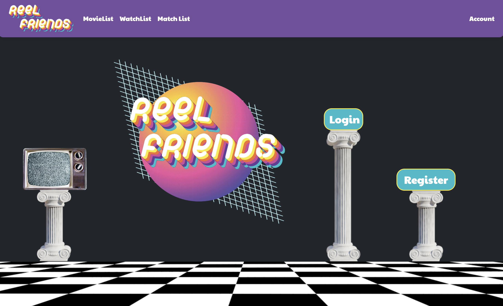

# 🎥 ReelFriends 🎬 

#### By Hayley McVay, Brenna Lavin, Tiffany Rodrigo, Will Greenberg, Jake Haley

 

 

## Technologies Used

* C#
* ASP.NET Core
* Entity Framework Core
* MySQL Workbench
* The Movie Database API

## Description

We all want some good company when watching our favorite movies. That's where ReelFriends comes in. With ReelFriends, you simply add movies you want to watch to your watchlist, and ReelFriends matches you with other users who also want to watch one of your movies! ReelFriends compares your watchlist to the other user's watchlist and displays matches based on match count. Now you have a Reel Friend! Make real friends with Reel Friends. 

## Setup/Installation Requirements

* To use this application you have to have MySql Workbench installed. Follow setup instructions [here!](https://www.learnhowtoprogram.com/c-and-net/getting-started-with-c/installing-and-configuring-mysql)
* Clone this repository down to your local machine.
* In the top directory (ForcedFriends.Solution) create an appsettings.json file with the following information `{ "ConnectionStrings":{ "DefaultConnection":"Server=localhost;Port=3306;database=firstname_lastname;uid=root; pwd=[YOURPASSWORDHERE];" } }`
* Save this file then navigate to the main project folder by typing `cd ForcedFriends` into your terminal.
* Type `dotnet restore` into the terminal to install project dependencies.
* Type `dotnet ef database update` into the terminal to ensure database is properly connected.
* To run program, type `dotnet run` into the terminal in the main project folder. (ForcedFriends)

## Known Bugs

* Currently there's no messaging system to communicate with your matches.
* User can currently add the same movie to their watchlist. A user shouldn't be able to add multiple same movies 
* Let us know if you find any!

## License

ISC License

Copyright (c) [2022] [Hayley McVay, Tiffany Rodrigo, Will Greenberg, Brenna Lavin, Jake C. Haley] 

Permission to use, copy, modify, and/or distribute this software for any purpose with or without fee is hereby granted, provided that the above copyright notice and this permission notice appear in all copies.

THE SOFTWARE IS PROVIDED "AS IS" AND THE AUTHOR DISCLAIMS ALL WARRANTIES WITH REGARD TO THIS SOFTWARE INCLUDING ALL IMPLIED WARRANTIES OF MERCHANTABILITY AND FITNESS. IN NO EVENT SHALL THE AUTHOR BE LIABLE FOR ANY SPECIAL, DIRECT, INDIRECT, OR CONSEQUENTIAL DAMAGES OR ANY DAMAGES WHATSOEVER RESULTING FROM LOSS OF USE, DATA OR PROFITS, WHETHER IN AN ACTION OF CONTRACT, NEGLIGENCE OR OTHER TORTIOUS ACTION, ARISING OUT OF OR IN CONNECTION WITH THE USE OR PERFORMANCE OF THIS SOFTWARE.